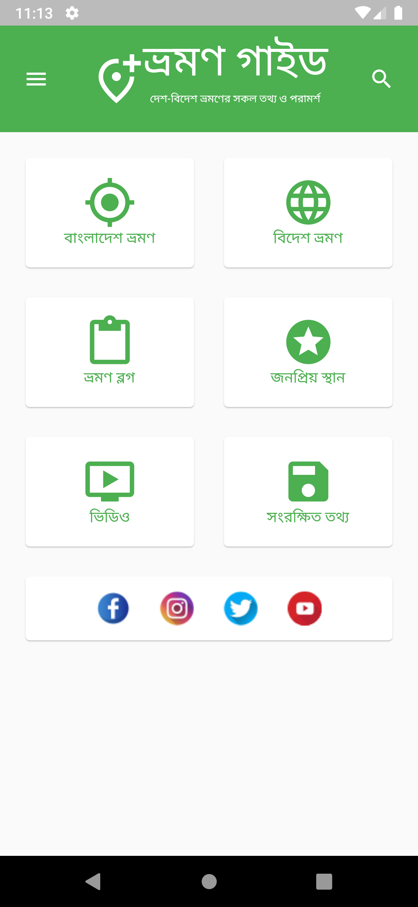
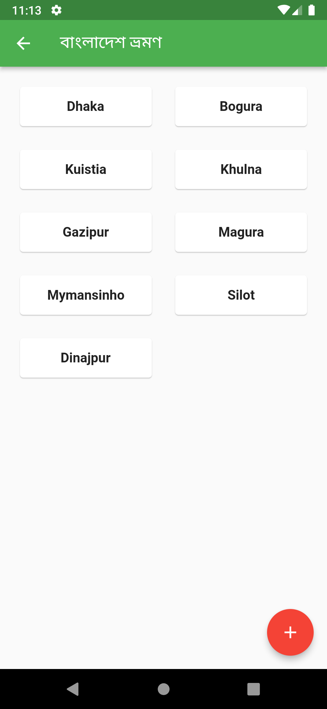
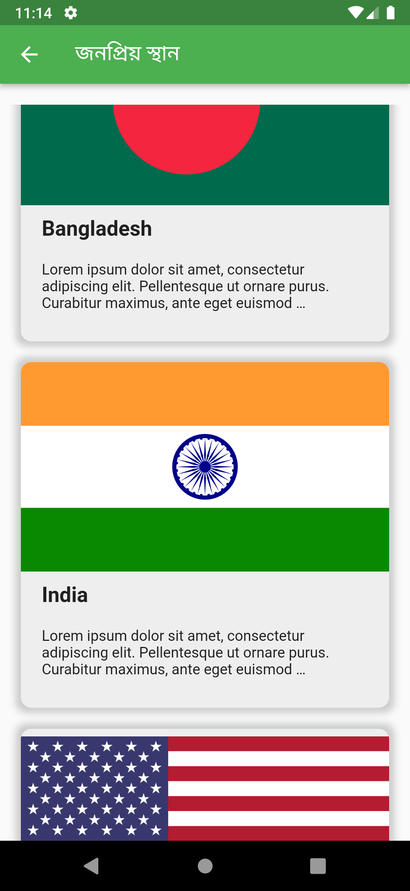

# Flutter_Travel_Guide_App
This is a demo app. Fully functional UI and backend. Connected with Firebase database. All the data that you see is coming from firebase database. Also you can add new data to database with ease. Here you will find information about different travel destinations in Bangladesh as well as different countries all around the world.

<a href="">Download and tryout the app</a>

</img>

<strong>Fig 1: Home Screen.</strong>

  

</img>

<strong>Fig 2: District Listview Screen.</strong>

  

</img>

<strong>Fig 3: Travel Destination Listview Screen.</strong>

  

</img>

<strong>Fig 4: Travel Destination details Screen.</strong>

  